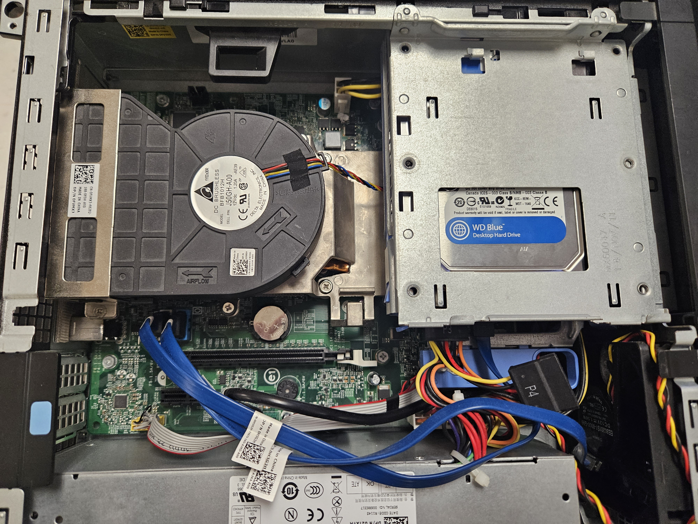

# SSHSCompSci.github.io
We are Sulphur Springs High School's Computer Science Class! 😄

So far this year we have...
 - Set up a linux system 
 - Participated in [CyberPatriot](https://www.uscyberpatriot.org/).
  

  
We took apart, cleaned and reconstructerd a pc.

   
  
   

 - We have built mutliple websites (Including this one!)
 - We have set up our own private network.

